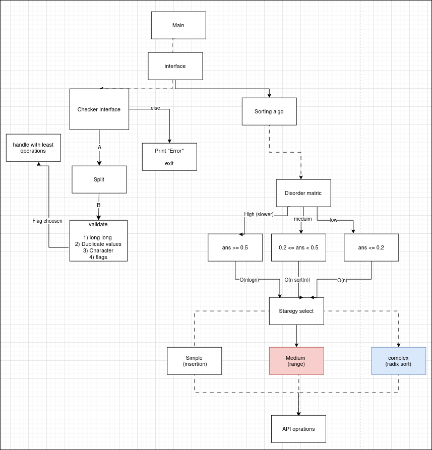
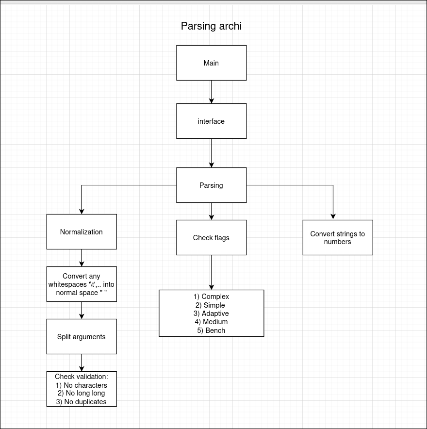
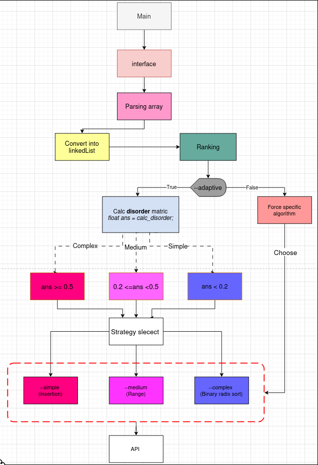

# Push_swap_project

The goal of this project is to discover algorithmic complexity in a very concrete way by using sorting  algorithms to sort stacks.

## High level archi 

## Parsing flow 

## Sorting-functions-flow

## Sorting algorithms used 

* [Range-sort-flow](https://lucid.app/lucidchart/3fd043e6-1ceb-47f8-9c95-d9e9ee9683ac/edit?viewport_loc=-4274%2C-1318%2C3798%2C2365%2C0_0&invitationId=inv_d72c658a-d3d3-4373-b05d-3f3c341c0835)

## Operations

* sa (swap a): Swap the first two elements at the top of stack a.
Do nothing if there is only one or no elements.
* sb (swap b): Swap the first two elements at the top of stack b.
Do nothing if there is only one or no elements.
* ss : sa and sb at the same time.
* pa (push a): Take the first element at the top of b and put it at the top of a.
Do nothing if b is empty.
* pb (push b): Take the first element at the top of a and put it at the top of b.
Do nothing if a is empty.
* ra (rotate a): Shift up all elements of stack a by one.
The first element becomes the last one.
* rb (rotate b): Shift up all elements of stack b by one.
The first element becomes the last one.
* rr : ra and rb at the same time.
* rra (reverse rotate a): Shift down all elements of stack a by one.
The last element becomes the first one.
* rrb (reverse rotate b): Shift down all elements of stack b by one.
The last element becomes the first one.
* rrr : rra and rrb at the same time

